## 小飞猪运维平台

Author: [ 迷城<safemonitor@outlook.com> ] [ 往事随风<gujiwork@outlook.com> ]</br>

该项目为devops-api的后端部分, 前端VUE部分请关注 :heart: [devops-web](https://github.com/small-flying-pigs/devops)
https://github.com/small-flying-pigs/devops


## Contents
* [介绍](#introduce)
* [预览](#looklike)
* [如何安装](#howtoinstall)
* [自运维功能实现](#whatcando)

## <a name="introduce"> 介绍 </a>
- 后端：Django 3.0 + REST framework + Celery
- 前端：Vue 3.0 + Ant Design of Vue


## <a name="looklike"> 预览 </a>
### 登陆界面
支持钉钉扫码登陆、账号密码登陆两种方式, 钉钉需要在管理后台创建应用

</br>

### 资产管理
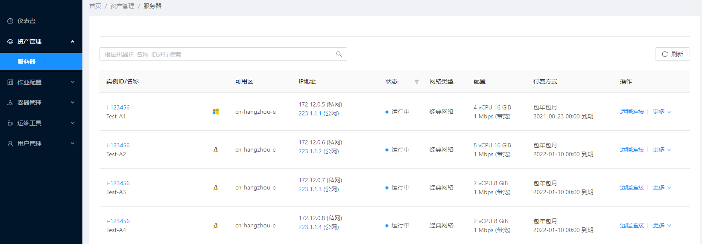
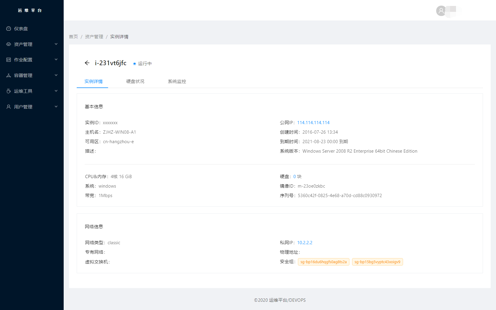
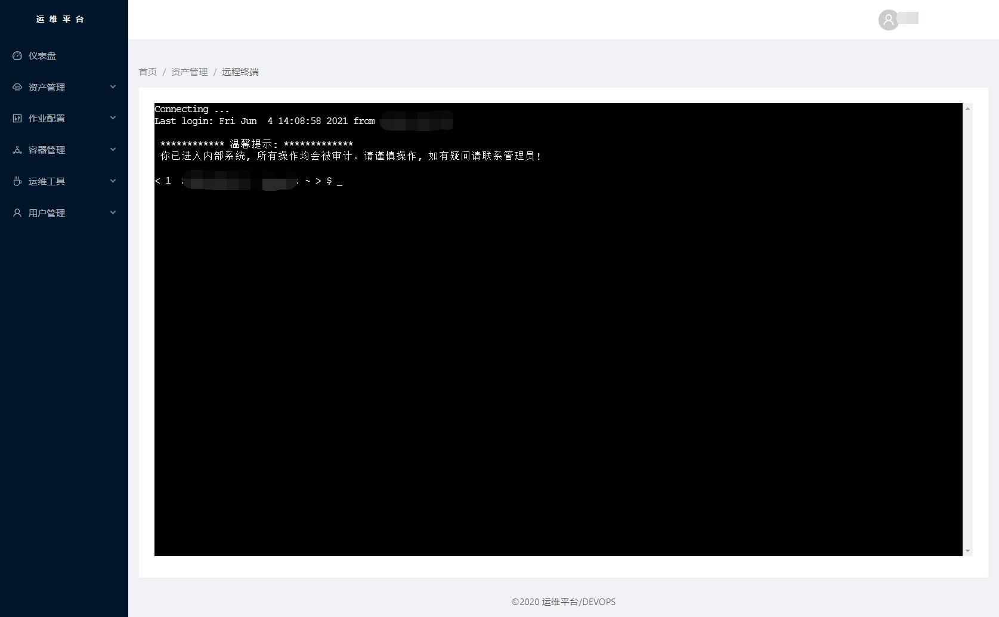

### 作业管理
!(img/job.png)
!(img/job2.png)
!(img/send_file.png)


### Kubernetes管理

Node节点池

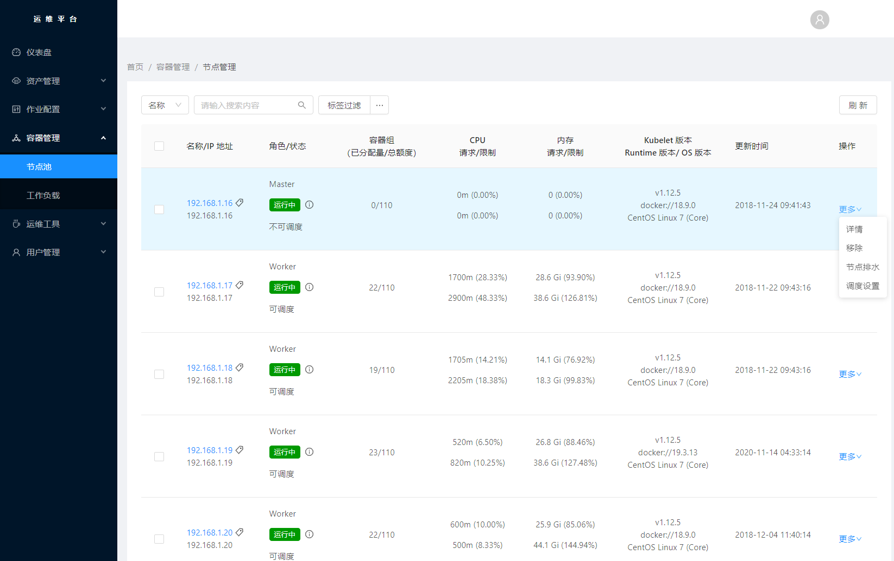

Node详情页
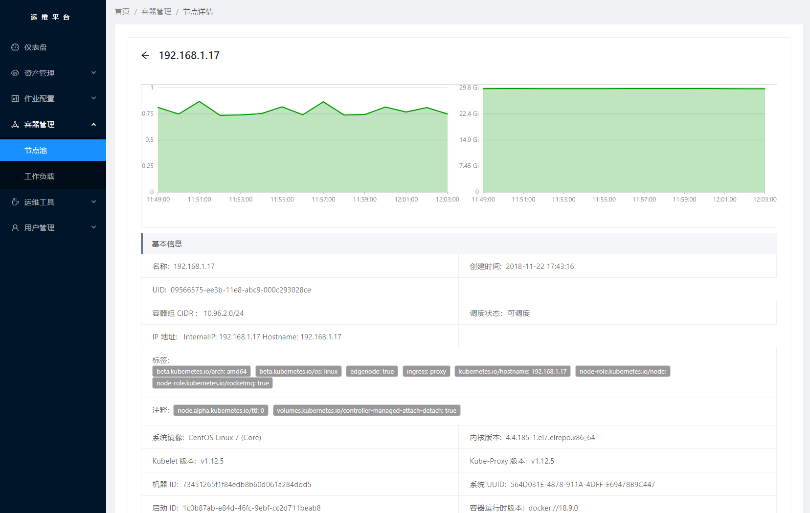

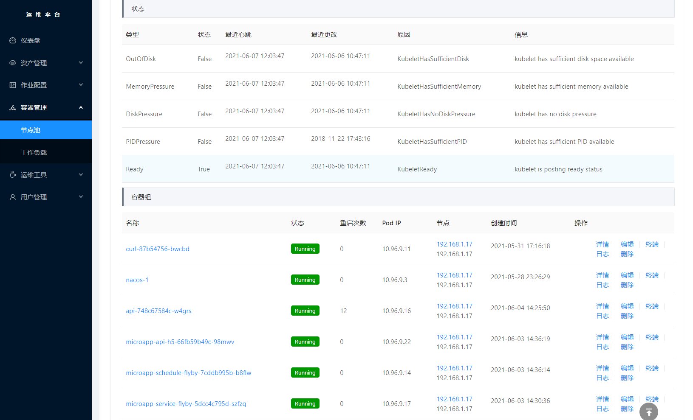

Deployment 无状态服务
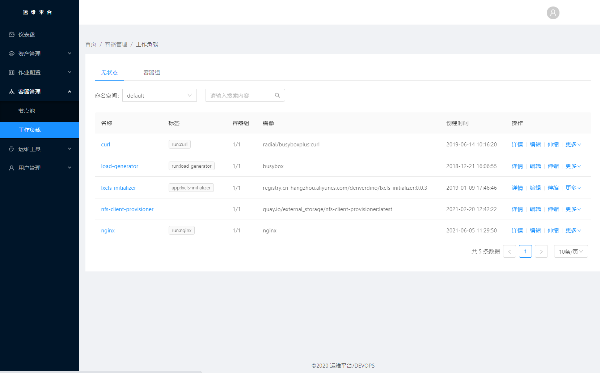

扩缩容
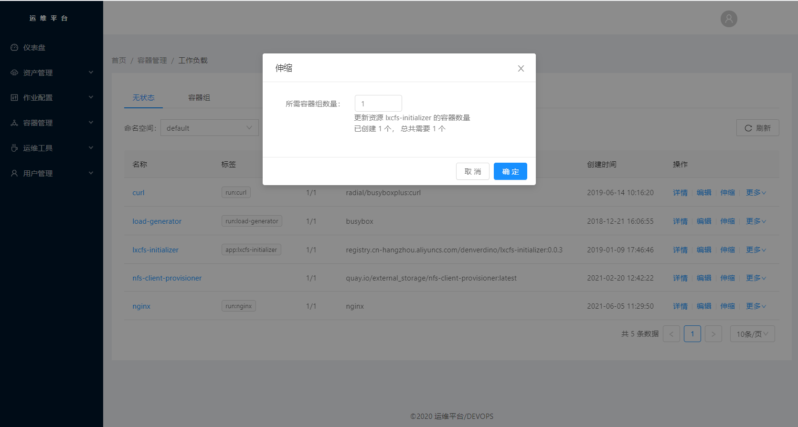

容器组
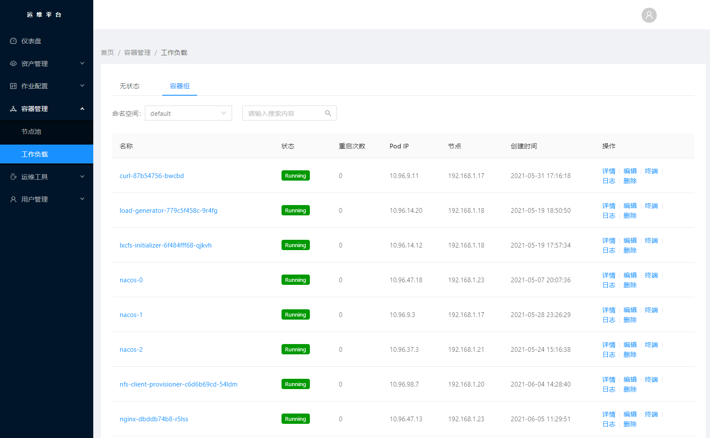

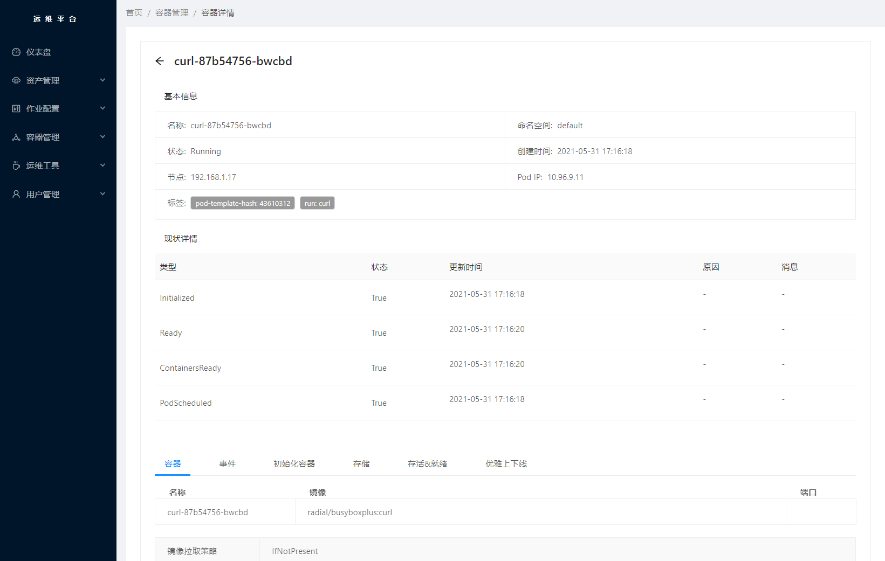
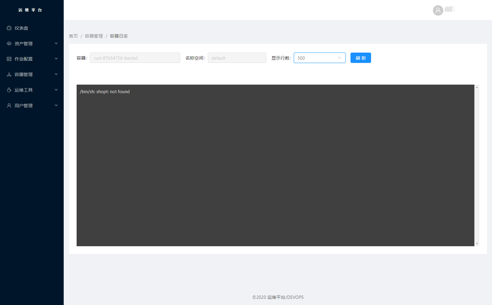
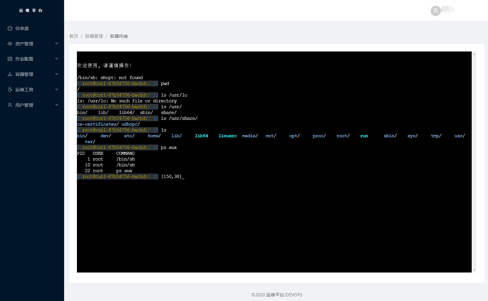
pod在线编辑
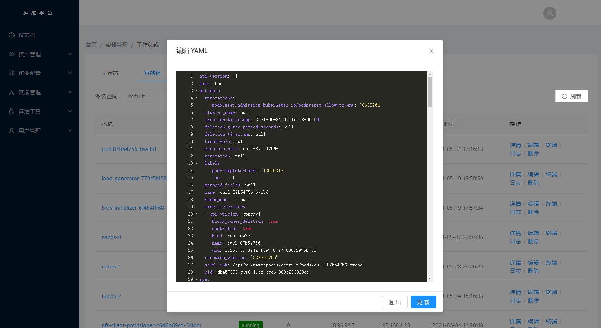

### JAVA应用在线诊断
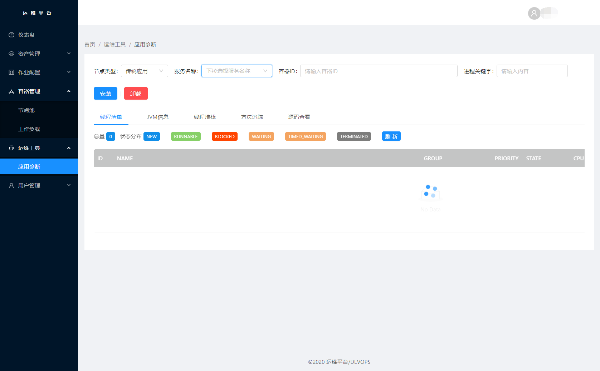
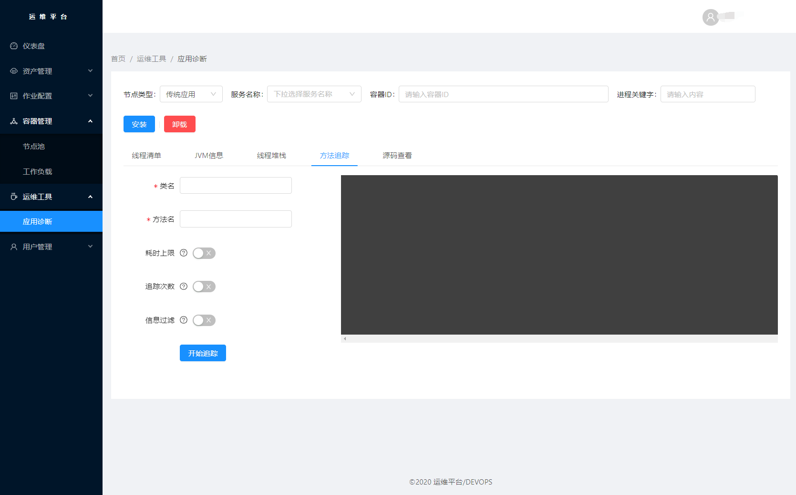

## <a name="howtoinstall"> 如何安装 </a>
devops-api依赖于python3.5以上、诸多python第三方模块、mysql数据库、redis缓存</br>
以下操作环境已经拥有python3.5、mysql数据库、redis缓存
```bash
$ cd path/to/project/folder/


#安装python第三方库
$ pip install -r requirements.txt

#修改.env 配置文件
将变量替换成自己对应的


#连接本地资源并创建数据表结构
$ vim deveops-api/.env # 里面包含了所有连接数据以及定时任务 请填写您需要的数据内容
$ python manage.py makemigrations
$ python manage.py migrate


#启动服务
$ python manage.py runserver &
#默认启动在8000端口 你可能需要一个nginx做Web服务器

```
注意： 请参考doc下面的相关文档, 推荐部署在Linux系统中。

#### 启动定时任务和异步任务
```
celery -A devops beat -l info

celery worker  -A devops --pool=solo -l INFO
```
#### 更多功能正在开发中.....

#### 开发者QQ群： 258130203
