## 小飞猪运维平台

Author: [ 迷城<safemonitor@outlook.com> ] [ 往事随风<gujiwork@outlook.com> ]</br>

该项目为devops-api的后端部分, 前端VUE部分请关注 :heart: [devops-web](https://github.com/small-flying-pigs/devops)
https://github.com/small-flying-pigs/devops


## Contents
* [介绍](#introduce)
* [预览](#looklike)
* [如何安装](#howtoinstall)
* [自运维功能实现](#whatcando)

## <a name="introduce"> 介绍 </a>
- 后端：Django 3.0 + REST framework + Celery
- 前端：Vue 3.0 + Ant Design of Vue


## <a name="looklike"> 预览 </a>
### 登陆界面
支持钉钉扫码登陆、账号密码登陆两种方式, 钉钉需要在管理后台创建应用

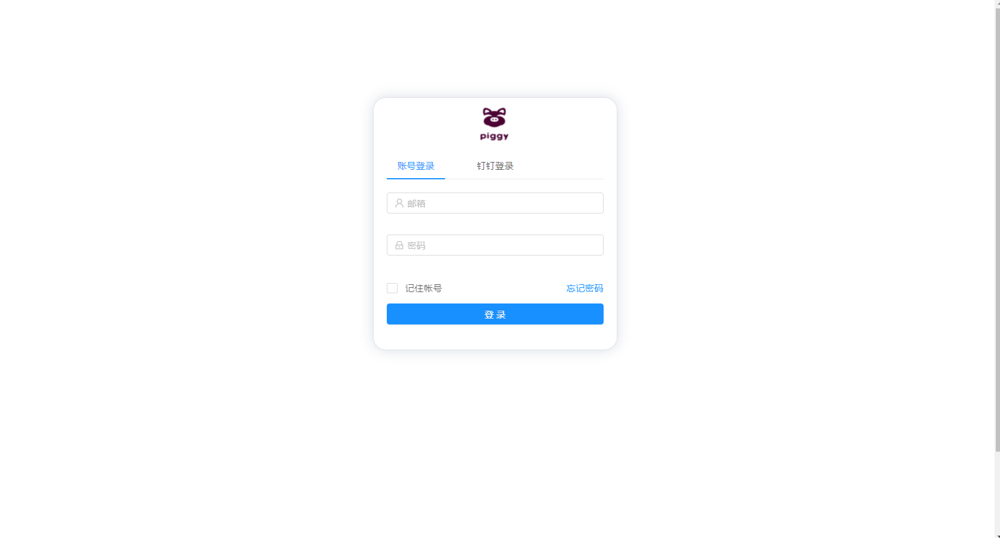</br>

### 仪表盘界面
展现一周应用部署情况、应用个数、工单等</br>

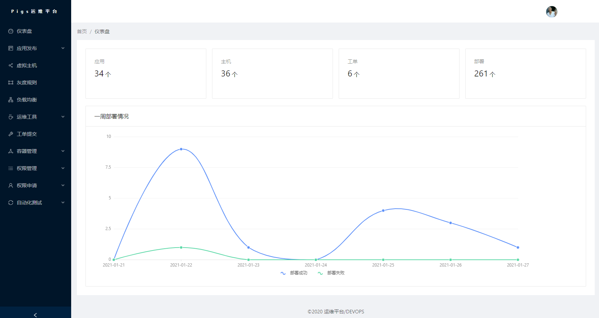

### 应用发布
 针对应用上线做了管控, 应用上线前需要提交上线审批单、测试通过报告

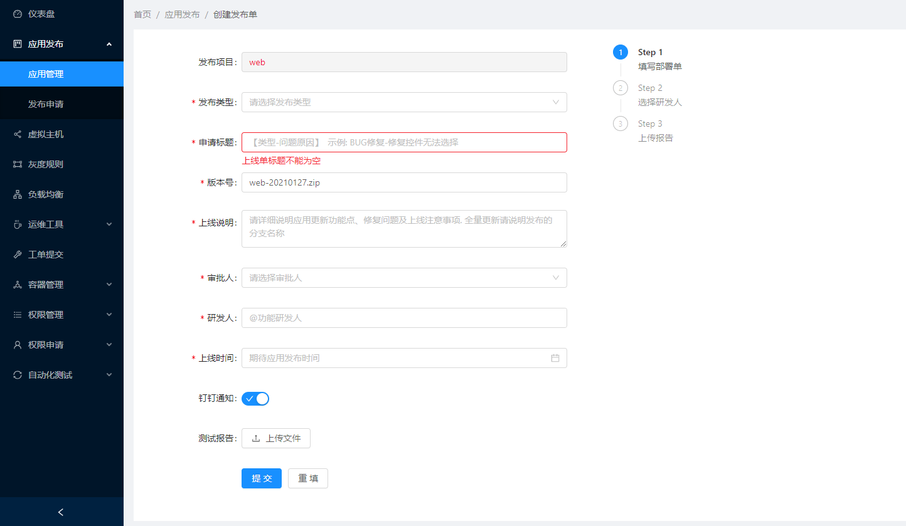</br>

通过部署详情可以查看部署进度、日志等 </br>

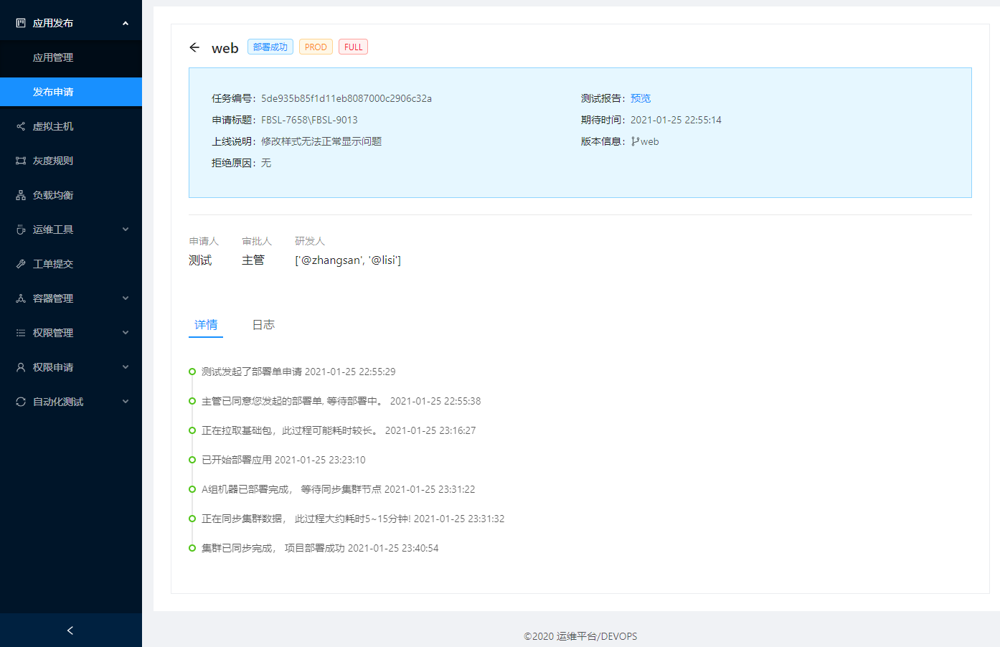


### 灰度规则
基于openresty lua 实现对域名的灰度访问, 支持三种灰度策略, ip、cookie、useragent

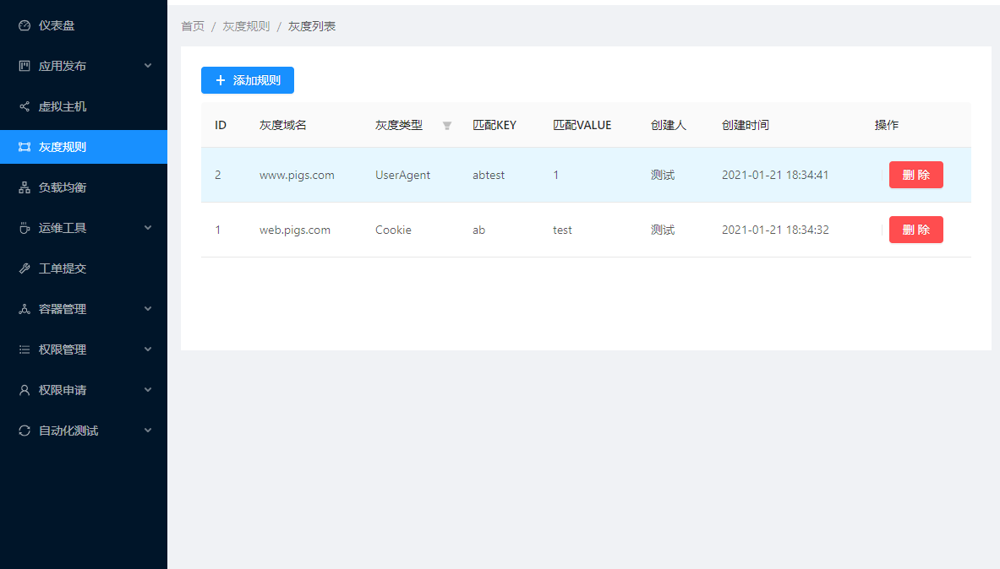

### ElasticSearch查询
由于es是自建服务, 为了线上安全不能直接提供es地址给开发查询, 通过python es api实现</br>

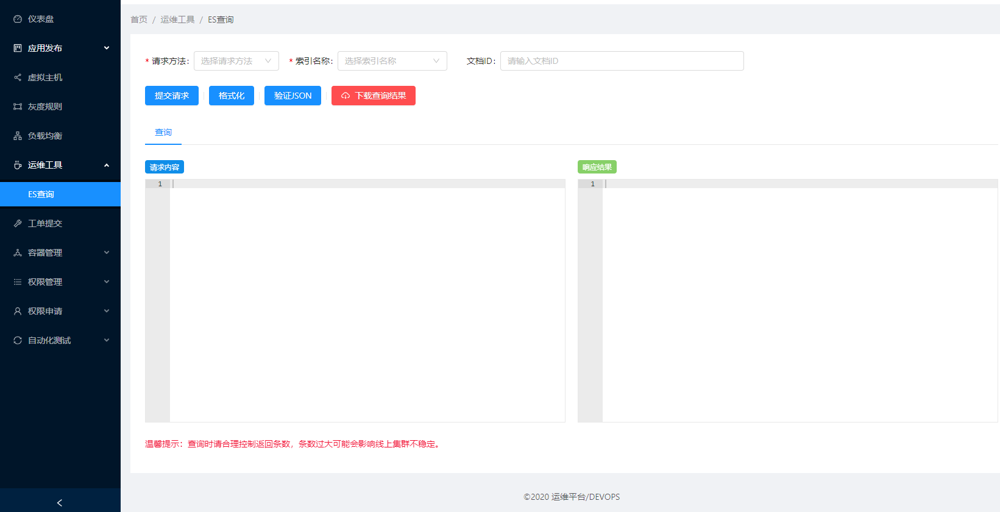

### Nginx主机管理
基于tengine + consul 实现对nginx虚拟主机的动态增加和删除</br>

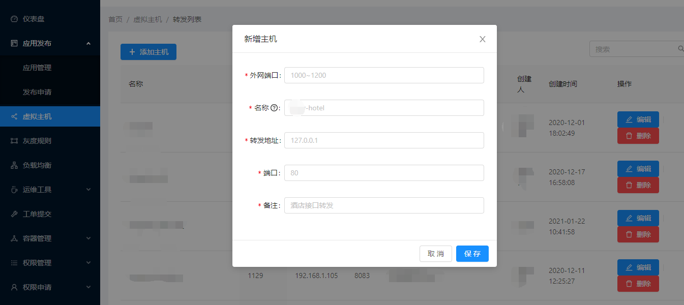

### 账号申请
覆盖了一些svn、gogs、阿里云ram、db、logs等账号实现了一键自动开通</br>

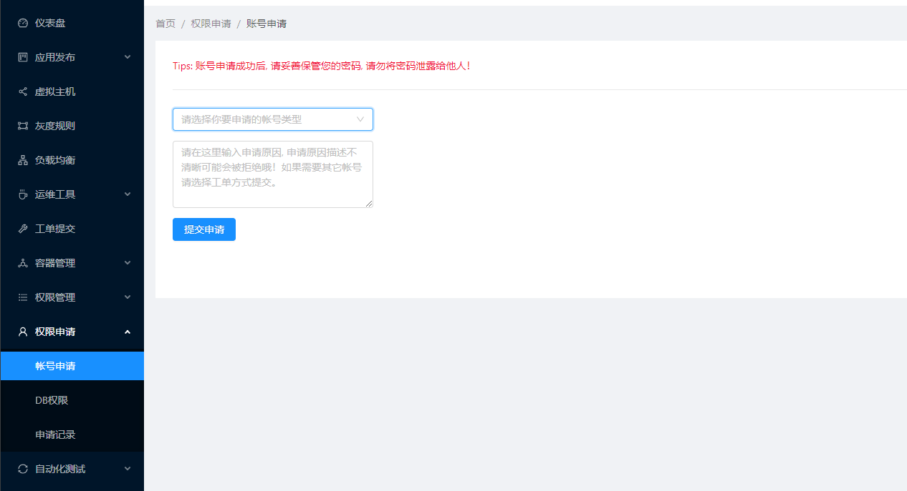

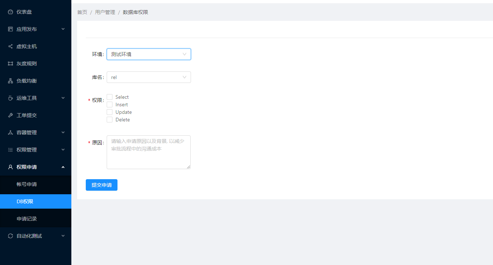

### 自动化测试
通过selenium实现对ui自动化测试</br>

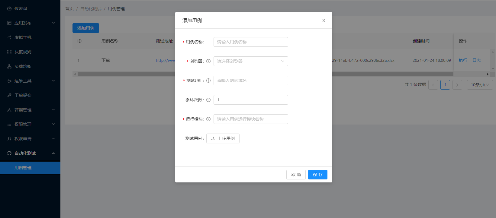

目前仅支持谷歌、火狐浏览器, 测试用例跑完后可通过日志查看详细信息


### K8S deployment管理

可以对Pod进行删除重启

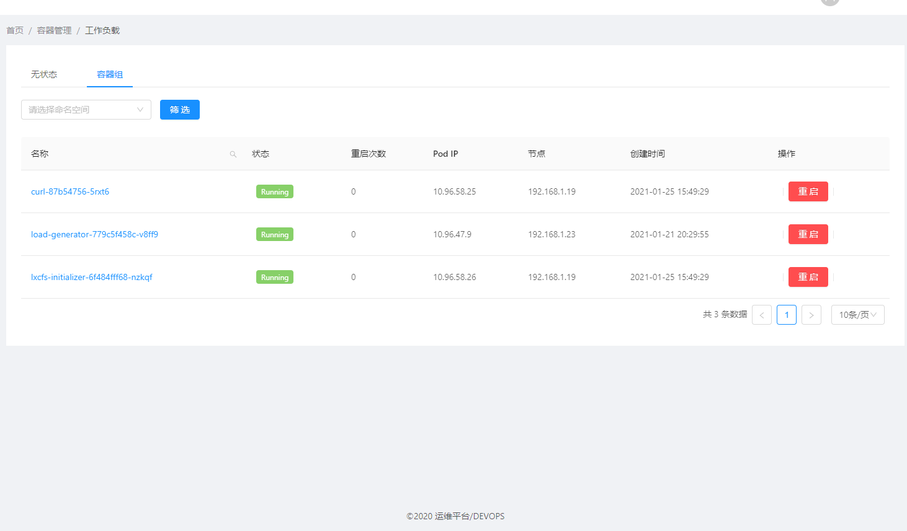

## <a name="howtoinstall"> 如何安装 </a>
devops-api依赖于python3.5以上、诸多python第三方模块、mysql数据库、redis缓存</br>
以下操作环境已经拥有python3.5、mysql数据库、redis缓存
```bash
$ cd path/to/project/folder/


#安装python第三方库
$ pip install -r requirements.txt

#修改.env 配置文件
将变量替换成自己对应的


#连接本地资源并创建数据表结构
$ vim deveops-api/settings.py # 里面包含了所有连接数据以及定时任务 请填写您需要的数据内容
$ python manage.py makemigrations
$ python manage.py migrate


#启动服务
$ python manage.py runserver &
#默认启动在8000端口 你可能需要一个nginx做Web服务器

```


#### 启动定时任务和异步任务
```
celery -A devops beat -l info

celery worker  -A devops --pool=solo -l INFO
```

##### 废弃老的任务
celery_tasks.tasks 


#### 开发者QQ群： 258130203
